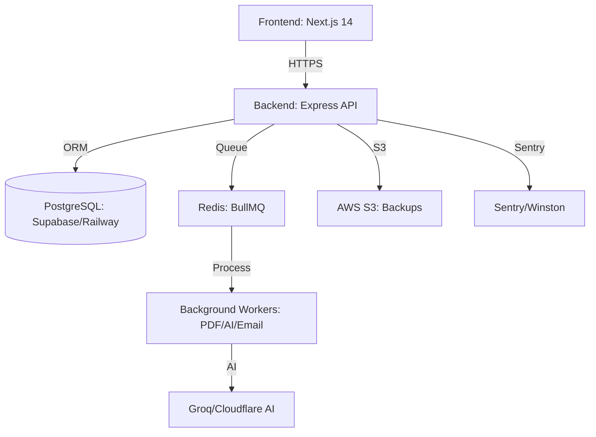

# System Architecture - MonCVPro

## Overview
MonCVPro is built using a modern, scalable microservices-inspired architecture but simplified for high-performance SaaS deployment.

## Core Components
- **Frontend:** Next.js 14 (App Router) deployed on Vercel. Uses Zustand for state management and Tailwind CSS for styling.
- **Backend API:** Node.js Express server on Railway. Handles authentication, CV management, and job orchestration.
- **Database:** PostgreSQL (managed) with Prisma ORM for type-safe data access.
- **Background Workers:** Dedicated processes for CPU-intensive tasks:
    - **PDF Worker:** Generates high-fidelity PDFs.
    - **AI Worker:** Interfaces with LLMs (Groq) for CV optimization.
    - **Email Worker:** Handles transactional emails via SMTP.
- **Caching & Queues:** Redis handles task queues for reliable background processing.

## Data Flow
1. **User Auth:** User logs in via JWT (Access + Refresh tokens). Refresh tokens are stored in HttpOnly cookies.
2. **CV Creation:** Frontend sends JSON to API. API encrypts sensitive fields and saves to PostgreSQL.
3. **AI Enhancement:** API pushes task to Redis. AI Worker processes it using Groq and updates DB. Frontend receives real-time updates via WebSockets.
4. **PDF Export:** PDF Worker converts CV data to optimized PDF format and provides a temporary download URL.

## Scaling Strategy
- **Frontend:** Global CDN deployment via Vercel.
- **Backend:** Horizontal scaling with Railway service replicas.
- **Database:** Read replicas for heavy analytics (planned).
- **Workers:** Can be scaled independently based on queue depth.
- **Static Assets:** Cloudinary for profile images and generated assets.
