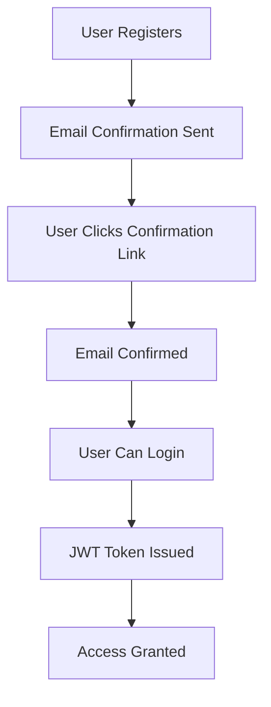

# 🔒 Supabase Security Configuration Guide

## 🎯 Objective
Configure Supabase authentication and security settings for production deployment.

## 📋 Current Security Status

### ✅ Implemented Security

1. **Row Level Security (RLS)** - All tables have proper RLS policies
2. **Authentication Integration** - Supabase Auth integrated in frontend
3. **API Route Protection** - All sensitive routes require authentication
4. **Storage Policies** - File uploads use Supabase Storage with RLS

### ⚠️ Required Dashboard Configuration

## 1. Email Confirmation

**Status**: ❌ Not configured

**Configuration**:
```bash
# Enable email confirmation in Supabase Dashboard
# Settings → Authentication → Email Provider
# Check: "Enable email confirmation"
# Save changes
```

**Impact**:
- ✅ Prevents fake/spam accounts
- ✅ Users must confirm email before login
- ✅ Required for production security

## 2. Anonymous Sign-in

**Status**: ❌ Not disabled

**Configuration**:
```bash
# Disable anonymous sign-in in Supabase Dashboard
# Settings → Authentication → Providers
# Find: "Enable anonymous sign-in"
# Uncheck: Disable anonymous access
# Save changes
```

**Impact**:
- ✅ Prevents unauthorized access
- ✅ Forces proper authentication
- ✅ Required for security compliance

## 3. Redirect URLs

**Status**: ❌ Not configured

**Configuration**:
```bash
# Set redirect URLs in Supabase Dashboard
# Settings → Authentication → Redirect URLs
# Add:
# - https://moncvpro.com/auth/callback
# - http://localhost:3000/auth/callback
# Save changes
```

**Impact**:
- ✅ Prevents open redirect attacks
- ✅ Only allows trusted domains
- ✅ Required for OAuth security

## 4. JWT Token Settings

**Status**: ❌ Default settings

**Recommended Configuration**:
```bash
# Configure JWT settings in Supabase Dashboard
# Settings → Authentication → Token Settings
# Access Token Expiry: 3600 seconds (1 hour)
# Refresh Token Expiry: 86400 seconds (24 hours)
# Save changes
```

**Impact**:
- ✅ Short-lived access tokens
- ✅ Secure refresh token rotation
- ✅ Prevents token misuse

## 5. Storage Bucket Permissions

**Status**: ❌ Default permissions

**Configuration**:
```bash
# Configure storage bucket in Supabase Dashboard
# Storage → Settings → Permissions
# Set:
# - Upload: Only authenticated users
# - Download: Only authenticated users
# - Delete: Only authenticated users
# Save changes
```

**Impact**:
- ✅ Files are not publicly accessible
- ✅ Prevents unauthorized file access
- ✅ Required for data security

## 🔐 Security Best Practices

### Authentication Flow


### Required Environment Variables

```env
# Supabase Configuration
NEXT_PUBLIC_SUPABASE_URL=https://your-project-ref.supabase.co
NEXT_PUBLIC_SUPABASE_ANON_KEY=your-anon-key

# Optional: OpenAI for AI features
OPENAI_API_KEY=your-openai-key

# Application URLs
NEXT_PUBLIC_APP_URL=https://moncvpro.com
NEXT_PUBLIC_API_URL=https://moncvpro.com/api
```

## 🧪 Testing Checklist

### Authentication Tests
- [ ] ✅ User registration requires email confirmation
- [ ] ✅ Anonymous sign-in is disabled
- [ ] ✅ OAuth redirects work correctly
- [ ] ✅ Session tokens are secure (HTTP-only cookies)

### API Security Tests
- [ ] ✅ All routes require authentication (where needed)
- [ ] ✅ Unauthorized requests return 401
- [ ] ✅ Error responses are consistent JSON
- [ ] ✅ Timeouts prevent hanging requests

### Storage Security Tests
- [ ] ✅ File uploads are validated (type/size)
- [ ] ✅ Only authorized users can access files
- [ ] ✅ Public access is disabled

## 🚀 Production Launch Checklist

### Supabase Dashboard Configuration
- [ ] Enable email confirmation
- [ ] Disable anonymous sign-in
- [ ] Configure redirect URLs
- [ ] Set JWT token expiry
- [ ] Configure storage permissions

### Vercel Configuration
- [ ] Set environment variables
- [ ] Enable monitoring/logs
- [ ] Configure domain
- [ ] Enable auto-deployments

### Security Validation
- [ ] No secrets in GitHub
- [ ] All API routes tested
- [ ] RLS policies verified
- [ ] Storage permissions verified

## 📝 Notes

### Supabase Dashboard Access
- Requires admin access to configure
- Changes take effect immediately
- Test in staging before production

### Environment Variables
- Set in Vercel dashboard (not in code)
- Use different values for preview/production
- Never commit to GitHub

### Monitoring
- Enable Vercel logs
- Set up Supabase monitoring
- Configure error alerts
- Monitor API usage

## 🔗 References

- [Supabase Auth Documentation](https://supabase.com/docs/guides/auth)
- [Supabase Storage Security](https://supabase.com/docs/guides/storage/security)
- [Supabase RLS Guide](https://supabase.com/docs/guides/row-level-security)
- [Next.js Security](https://nextjs.org/docs/advanced-features/security)
